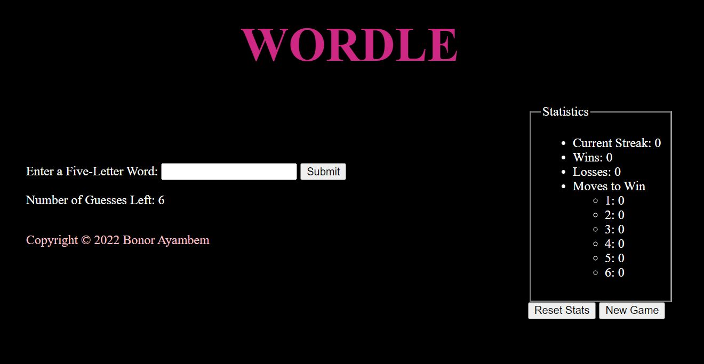
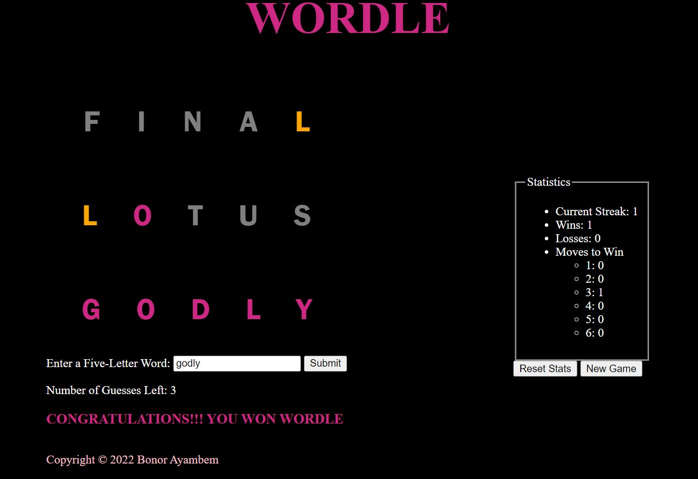

# Wordle Web Program

## Purpose

This project is a simulation of the popular Wordle game

## Project Description

This project is a simple web programming design that makes use of HTML, Javascript,
and CSS. The frontend webpage is designed in public/index.html and public/styles.css
and most of the functionality is achieved via interactions between scrips.js, app.js,
and public/index.html.

## Run Instructions

- Run `node app.js` in a terminal
- In a web browser, visit `localhost:3000`

## Test Run

Player has six guesses to provide a pre-determined five-letter word in the text box

In each guess, the letters are colored to provide a hint as to the player's closeness
to getting the word

* Pink - Letter is in the right spot

* Orange - Letter is in the word but is not in the right spot

An example run is provided below

